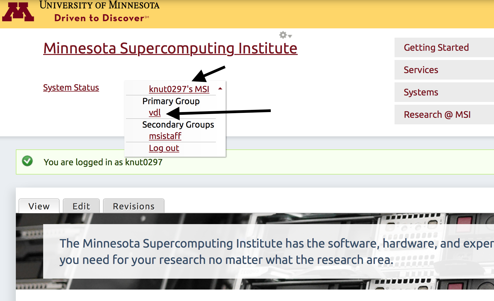

# How to connect to MSI systems

Todd Knutson  


## Introduction

The following is a brief introduction for how to connect to MSI's systems.


### Users and groups
Every primary investigator (PI) has an MSI group account, usually called something related to their last name. For example, Prof. Michael Farrar's group is called `farrarm`. Currently, each PI can add group members and enable some members to have administrator access to this group account (which allows for adding/removing users). Each "user" of the group is assigned a username by MSI which is the same as the beginning of your UMN internet ID. For example, Todd's username is `knut0297` because his email address is `knut0297@umn.edu`. Every user of the group will be assigned a "user home directory" that is a folder (also called a directory) on the supercomputer (in the tier 1 storage space) that will contain all the data that user generates. The location of this folder is within the group account. For example, Todd's home directory is located at `/home/lmnp/knut0297` on the supercomputer storage space.  


### MyMSI and how to add a user
Only a group administrator can add a new user. The group admin must log on to [http://msi.umn.edu](msi.umn.edu) and sign-in. Clicking on the downward arrow next to the user's name will reveal any groups in which they are members. If you click on the user's name link (e.g. knut0297's MSI), you can access the "myMSI" page, where you can click on "manage Accounts in my Groups". (See figure below). There, you can add a new user to the group. Clicking on your group name link (e.g. `lmnp`) will reveal how much storage is available and other important information. 




### Recommended software for accessing MSI
I recommend using the following software for running bioinformatics analysis. Some of these are necessary to access MSI resources. 

Apple Mac:  

* SFTP client: Cyberduck [https://cyberduck.io](https://cyberduck.io) or Transmit [https://panic.com/transmit](https://panic.com/transmit) (Transmit is my personal favorite)
* SSH terminal: Terminal.app (that comes with Apple Macs in the `Applications/Utilities` folder) or iTerm2 [https://www.iterm2.com](https://www.iterm2.com)  
* Text Editor: BBedit [https://www.barebones.com/products/bbedit](https://www.barebones.com/products/bbedit)    


Windows:  

* SFTP client: Cyberduck [https://cyberduck.io](https://cyberduck.io)     
* SSH terminal: PuTTY [http://www.putty.org](http://www.putty.org)  
* Text Editor: Notepad++ [https://notepad-plus-plus.org](https://notepad-plus-plus.org)  


#### SFTP app preferences

* Transmit

	1. Transmit > Preferences...
	1. (General tab) Default FTP client: Transmit
	1. (General tab) Windows open with: None & None
	1. (General tab) Tab title shows: Folder
	1. (Files tab) Double Click Action: Edit in External Editor
	    * (Files tab) Custom Editors: + to add new, File Extension: xlsx; Choose: Microsoft Excel
	    * (Files tab) Custom Editors: + to add new, File Extension: pdf; Choose: Preview
	    * (Files tab) Custom Editors: + to add new, File Extension: txt; Choose: BBEdit
	    * (Files tab) Custom Editors: + to add new, File Extension: *; Choose: BBEdit
	    * ... Repeat for all your favorite file types and apps.
	1. (Advanced tab) Click on "Advanced Server Settings..."
	    * Network: (Check the box) Limit Server to "1" connections
	
	If you use ssh keys to connect to MSI hosts:
	
	* Setup a `Host` in `~/.ssh/config` to specify the private key file (`IdentityFile`)
	* Do not tell Transmit about your keys (e.g. use password based authentication in Transmit)
	* Enter your ssh key passphrase into the "Password" field when setting up Transmit
	* Transmit will use your ssh key for the connection and enter the passphrase automatically

	
	Check out this screencast demonstrating how to download, install, and setup Transmit and use it with BBEdit on a Mac: [https://drive.google.com/file/d/11hS4EBIQwK8nR4CXhC4odNBdTIGK9YJR/view](https://drive.google.com/file/d/11hS4EBIQwK8nR4CXhC4odNBdTIGK9YJR/view).

* Cyberduck
	1. Cyberduck > Preferences...
	2. (Browser tab) Double click opens file in external editor (check yes)
	3. (Editor tab) Choose BBEdit

	
	

### Connecting to MSI

> **Note**: You can watch a screencast of how to log on to MSI using this link. This video is currently a little out of date, but I think still works. [https://drive.google.com/open?id=0B4n-3EXQfHqpMjBIZGVPaDZvTU0](https://drive.google.com/open?id=0B4n-3EXQfHqpMjBIZGVPaDZvTU0)


Connections to MSI software and data can be done using an SFTP (secure file transfer protocol) client and/or a SSH terminal. To access MSI, you must be on the University of MN network, or VPN to the UMN network (see below) if you're off campus. MSI has two different supercomputers that you can access, with different names: `mesabi` or `mangi`.


#### How to connect from a Windows computer
Open the SSH terminal app. If you are using PuTTY, configure the app with the following details:

Hostname: `mesabi.msi.umn.edu` (or `mangi.msi.umn.edu`)  
Username: your email prefix/MSI username (e.g. `knut0297`)

Click "connect", which will prompt you for your UMN email password.


#### How to connect from a Apple Mac computer
Open the Mac Terminal.app, type the following at command prompt (replacing USER with your MSI username):

```
ssh USER@mesabi.msi.umn.edu

# or

ssh USER@mangi.msi.umn.edu
```

You will be prompted for your UMN email password. Enter the password, even though the cursor will not move -- the password is still being entered. Then press the return/enter key. Alternatively, you can set up ssh keys to enhance security and avoid typing you password.


#### General connection steps (same for Mac/Windows)
After connecting to MSI as described above, you should now be connected to an actual high performance login node (i.e. supercomputer).


You should now connected to the "login node" of a high performance computer. Here you can submit jobs using `sbatch` or view files. However, if you wanted to run some intensive bioinformatics applications you will need to request "interactive" resources using `srun`, etc. 

In addition, you can also see all of your files by connecting via a SFTP client (e.g. Cyberduck). You can work from both the Terminal app and the SFTP client at the same time -- but make sure to always hit the "refresh" button in the SFTP client because new files (or deleted files) will not automatically be updated without hitting refresh (kind of a bummer). Another trick is to go into your SFTP client preferences and set your "Editor" to either BBedit or Notepad++. Then when you click the "edit" button in the toolbar of your client, the file you want to view will be opened from the server, where you can see or edit it, then hit save, and the file is re-saved to the server with your changes applied. 


### Exiting MSI Terminal
To exit a MSI terminal, just type `exit` until you are completley disconnected and are back to you local machine. Or you can simply quit the terminal application. 


### Using a VPN to connect to the University of MN network

To access MSI (via a SFTP client or Terminal) off campus, you'll need to connect to campus via a VPN connection. You can learn more about how to make this connection from the UMN website [https://it.umn.edu/virtual-private-network-vpn](https://it.umn.edu/virtual-private-network-vpn). Once you are connected using a VPN, it's like you're sitting on campus and you can now access MSI (or the regular VDL shared drive). 


