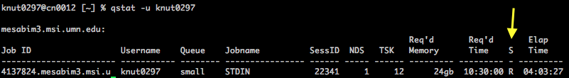

## How to access the MSI supercomputers


### Users and groups
The VDL has a MSI group account called `vdl` where the director, Jerry Torrison, is the primary investigator (PI). Currently, Todd Knutson also has administrator access to this group account (which allows for adding/removing users). Dr. Torrison can add people administrators, or you can email [help@msi.umn.edu](help@msi.umn.edu), and they can help with account issues. Each "user" of the group is assigned a username by MSI which is the same as the beginning of your UMN internet ID. For example, Todd's username is `knut0297` because his email address is `knut0297@umn.edu`. Every user of the group will be assigned a "user home directory" that is a folder (also called directory) on the supercomputer that will contain all the data the user generates. The location of this folder is within the `vdl` group account. For example, Todd's home directory is located at `/home/vdl/knut0297` on the supercomputer storage space (i.e. hard drive).  


### MyMSI and how to add a user
Only a group administrator can add a new user. The group admin must log on to [http://msi.umn.edu](msi.umn.edu) and sign-in. Clicking on the downward arrow next to the user's name will reveal any groups in which they are members. If you click on the user's name link (e.g. knut0297's MSI), you can access the "myMSI" page, where you can click on "manage Accounts in my Groups". (See figure below). There, you can add a new user to the group. Clicking on your group name link (e.g. vdl) will reveal how much storage is available and how many service units are available to the group. 


### Recommended software for accessing MSI
I recommend using the following software for running bioinformatics analysis. Some of these are necessary to access MSI resources. 

Apple Mac:  

* SFTP client: Cyberduck [https://cyberduck.io](https://cyberduck.io) or Transmit [https://panic.com/transmit/](https://panic.com/transmit/)
* SSH terminal: Terminal.app (that comes with Apple Macs in the `Applications/Utilities` folder) or iTerm2 [https://www.iterm2.com](https://www.iterm2.com)  
* Text Editor: BBedit [https://www.barebones.com/products/bbedit/](https://www.barebones.com/products/bbedit/)    
* Genome Alignment Visualization: Integrative Genomics Viewer (IGV) [http://software.broadinstitute.org/software/igv/download](http://software.broadinstitute.org/software/igv/download)  

Windows:  

* SFTP client: Cyberduck [https://cyberduck.io](https://cyberduck.io)     
* SSH terminal: PuTTY [http://www.putty.org](http://www.putty.org)  
* Text Editor: Notepad++ [https://notepad-plus-plus.org/download/v7.5.html](https://notepad-plus-plus.org/download/v7.5.html)  
* Genome Alignment Visualization: Integrative Genomics Viewer (IGV) [http://software.broadinstitute.org/software/igv/download](http://software.broadinstitute.org/software/igv/download)  


### Connecting to MSI

**Note**: You can watch a screencast of how to log on to MSI using this link: [https://drive.google.com/open?id=0B4n-3EXQfHqpMjBIZGVPaDZvTU0](https://drive.google.com/open?id=0B4n-3EXQfHqpMjBIZGVPaDZvTU0)


Connections to MSI software and data can be done using an SFTP (secure file transfer protocol) client and/or a SSH terminal. To access MSI, you must be on the University of MN network, or VPN to the UMN network (see below) if you're off campus.


#### How to connect from a Windows computer
Open the SSH terminal app. If you are using PuTTY, configure the app with the following details:

Hostname: `login.msi.umn.edu`  
Username: your email prefix/MSI username (e.g. `knut0297`)

Click "connect", which will prompt you for your UMN email password.


#### How to connect from a Apple Mac computer
Open the Mac Terminal.app, type the following at command prompt (replacing USER with your MSI username):

```
ssh USER@login.msi.umn.edu
```
You will be prompted for your UMN email password. Enter the password, even though the cursor will not move -- the password is still being entered. Then press the return/enter key.


#### General connection steps (same for Mac/Windows)
After connecting to MSI as described above, you should now be connected to the first MSI login node (i.e. computer). To connect to an actual high performance node (i.e. supercomputer), you will need to type the following:

```
ssh mesabi
```
If you wanted to connect to a different supercomputer, type `ssh itasca` or `ssh lab`, but mesabi is the fastest supercomputing node and should generally be used first. However, only the `lab` node is connected to the outside internet, so it is required for certain applications (like downloading software from outside websites or running BLAST searches on the NCBI servers in `blastn -remote` mode. 

You should now connected to the "login node" of a high performance computer. Here you can submit jobs (i.e. run `tk_kraken_wrapper` or `tk_assembly_wrapper`, etc.). However, if you wanted to run some intensive bioinformatics applications you will need to request "interactive" resources (see below). 

In addition, you can also see all of your files by connecting via a SFTP client (e.g. Cyberduck). You can work from both the Terminal app and the SFTP client at the same time -- but make sure to always hit the "refresh" button in the SFTP client because new files (or deleted files) will not automatically be updated without hitting refresh (kind of a bummer). Another trick is to go into your SFTP client preferences and set your "Editor" to either BBedit or Notepad++. Then when you click the "edit" button in the toolbar of your client, the file you want to view will be opened from the server, where you can see or edit it, then hit save, and the file is re-saved to the server with your changes applied. 


### Requesting computing resources from MSI
You can run many applications from the mesabi login node. However, if you want access to parallel threads or a large amount of RAM, you need to request these resources. The limits of each supercomputer are outlined on the MSI website: [https://www.msi.umn.edu/queues](https://www.msi.umn.edu/queues) where each "queue" has different parameters. For example, if I wanted to request a single compute node, with 12 processors, 12 GB of RAM, for 6 hours, I would type the following:

```
qsub -I -l nodes=1:ppn=12,mem=24GB,walltime=06:00:00
```

Notice, that the `qsub` program is run with the option `-I` for "interactive" mode and the `-l` option is used to specify the "limits" we'd like to request. 

Alternatively, you can prepare a text file (called a PBS job) that contains all of your commands that can be submitted to the supercomputer for processing. Details for how to create a new PBS job can be found here: [https://www.msi.umn.edu/content/job-submission-and-scheduling-pbs-scripts](https://www.msi.umn.edu/content/job-submission-and-scheduling-pbs-scripts).

### Checking on the status of your PBS jobs
You can see the current status of your PBS jobs by typing the following (replacing `USER` with your username):

```
qstat -u USER
```
This will return a table of information (See figure below). The table will list each of your jobs in rows and other details. Importantly, the "S" (status) column will indicate one of three possible values "R", "C", or "Q". If the value is "Q" your job is in the queue waiting to start. If the status is "R", the job is currently running. If the status is "C", the job is complete (whether successful run or not, it's done). 




### Exiting MSI Terminal
To exit a MSI terminal, just type `exit` twice (once to exit the `mesabi` node, and once to exit the first login node). Or you can simply quit the terminal application. 


### Using a VPN to connect to the University of MN network

To access MSI (via a SFTP client or Terminal) off campus, you'll need to connect to campus via a VPN connection. You can learn more about how to make this connection from the UMN website [https://it.umn.edu/virtual-private-network-vpn](https://it.umn.edu/virtual-private-network-vpn). Once you are connected using a VPN, it's like you're sitting on campus and you can now access MSI (or the regular VDL shared drive). 


